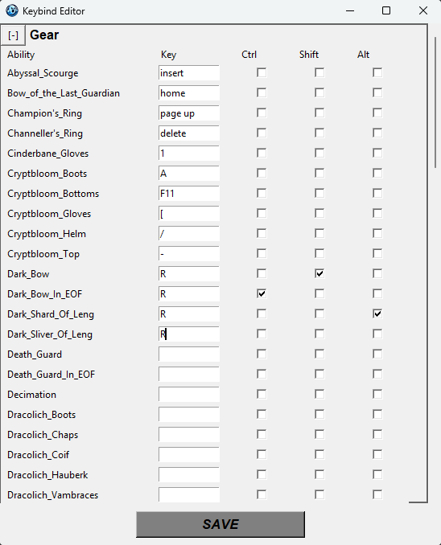

## Quickstart
ONLY FOR WINDOWS 
[Download here](https://github.com/blueboy4g/RS_Trainer/blob/main/Output/AzulynSetup.exe), click the three dots in the top right corner of the webpage and select "Download" to download the installer.

[MAC DOWNLOAD](https://github.com/blueboy4g/RS_Trainer/blob/mac_1.0.0/README.md)

You'll want to edit keybinds inside the software once you launch it.

Create or import new boss rotation files that you can use in game either via an overlay or in a standalone application.

[HOW TO USE THIS SOFTWARE](https://youtu.be/DbwiqWMt4tI)


[](https://youtu.be/DbwiqWMt4tI)

## Keybinds
See example keybinds below.

Modifiers such as "CTRL", "ALT", and "SHIFT" are supported just check the checkbox in the UI!
```json
  In the "Edit keybinds" you can put A-Z, 1-9, F1-F12, and any special characters a couple examples:
  delete, page up, page down, home, end, insert, [, ], \, -, `, /, and more!

  When left blank a user can either click in the UI OR hit spacebar (can configure in config file to any button) to mark as completed.
```

## FAQ

[FAQ VIDEO](https://youtu.be/AmuDzXJdMcA)


[](https://youtu.be/AmuDzXJdMcA)

### The Azulyn overlay won't stay ontop my screen, it keeps going behind stuff!
This happens when you click quickly after starting the app into RuneScape or another window. To fix close the overlay and whatever window is going on top likely RuneScape and relaunch both. After launching the overlay don't immediately click into the game, wait until the overlay starts before clicking into the game.

### Why does windows Defender say this could be a virus? 
Windows says that about every program that doesn't have a verified certificate. It's to be expected from indie projects if you want more security info watch the QA video or ask on discord.

### Want to uninstall?
Go to C:\Program Files\RS Trainer and run the unins000.exe file, or go to Control Panel\Programs\Programs and Features and uninstall it from there.
After that go to C:\Users\<Your username>\AppData\Roaming\Azulyn and delete the Azulyn folder to remove all settings and data - Note: this will delete your key binds, and you will have to re-enter them later if you reinstall!

## Donate
Support would be very much appreciated! It would help my wife understand I'm not wasting all my time...  

You can donate via: https://buymeacoffee.com/azulyn


## Resources
https://www.youtube.com/@Azulyn1

https://discord.gg/XRxsHtcPRJ

## For other developers
Want to remake this .exe? You can install Inno Setup 6.4.3, run build_dist_final.py and use the AzulynSetup.iss file in the root of this repository inside Inno to create an .exe!

Want to run in python? Don't run main directly it won't work if it's not an .exe, instead run the rs_overlay.py file with the config you want set inside rs_overlay.
